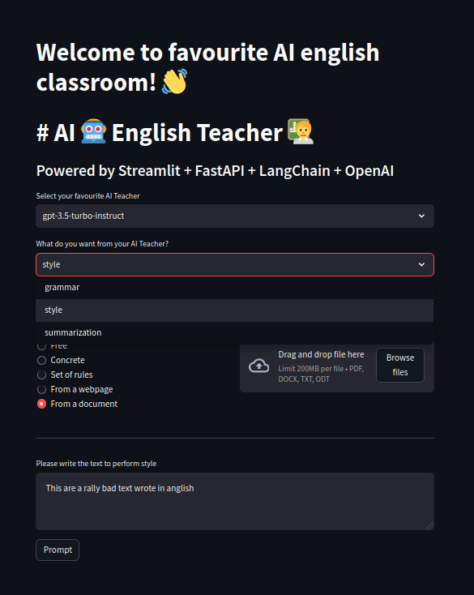

# AI English Teacher

Premise of this project:

Develop a Python-based application leveraging the OpenAI API and Transformers
library to create an agent that assists non-native English speakers in improving their
written English. The application should not involve model training or fine-tuning but
should focus on effective prompt engineering using the Retrieval-Augmented
Generation (RAG) approach (if/when needed). The agent will provide three primary
functionalities:
- write_the_same_grammar_fixed: Corrects only the grammatical errors in the input message.  ---> "grammar" option
- write_properly: Enhances both grammar and style of the input message.   ---> "style" option
- summarize: Provides a concise summary of the input message.   ---> "summarization" option



## Technical considerations
1. Prompt Engineering for RAG:
The project combines different prompt engineering and RAG (Retrieval Augmented Generation) techniques in accordance with the most installed techniques in the current technological landscape and in accordance with the syntax and logic that the most advanced Generative AI models (as in our case, OpenAI ) need and understand better.
For the summarization techniques (both for style and summarization) have been used these RAG techniques:
(According to high-level StuffDocumentsChain from langchain):


(According to high-level MapReduceDocumentsChain from langchain in combination with sklearn KMeans ML clustering):


- This project uses the simplest way to achieve all illustrated above using high-level classes, do not intend to get deeper in the fine use of techniques, entities and use cases
  
2. API Utilization Strategy:
The project has a backend and frontend, which can be orchestrated through Docker with docker compose or can be executed separately through Makefile commands (see "Usage").
- Frontend: It is designed with the python streamlit framework
- Backend: It is designed with FastAPI and langchain, at a high level, since this project aims to show, in a simple way, the ability of AI models to perform complex reading comprehension operations, but designed at a high level
  - It provides an infrastructure based on a microservices pattern (repository / services orientation) and dependency injection, bus and adapters. Scalable, strongly typed and object-oriented paradigm (also has some imperative programming). FastAPI offers a Swagger UI with all the well-detailed API documentation.

In this case I have opted for the simplicity of a single entrypoint with all the options, although it could perfectly have been divided into different entrypoints according to the premises set out above. (probably, with a view to scalability, it would be the most correct)

3. Handling Ambiguity in User Inputs:

Syntactically and operationally, and at the internal programming level, I use data validation provided by pydantic, in addition to strong typing and a powerful UI (if used), which directs the user to the type of input they have (and can) enter.
Additionally, there are internal validations in the classes for dependent combinations (such as, for example, if I choose to have a text styled according to the article writing style of an author of a web page; if that type of style is chosen, the web page must be provided and must be valid, and the text must be obviously provided)

Semantically, I have not had time to implement practically anything but of course I have many ideas that could improve the efficiency, capacity and speed of our system. Here are some ideas:
- Our application emulates an "English teacher". Therefore, a first validation such as dependency injection in the middleware of the entrypoints that will detect the input language and confirm that it is English.

```
# In deps.py
async def get_language(request: Request):
     text = request.get("text")
     if some_lang_detector(text) != Language.ENG:
         raise ValueError("...")

# In the entrypoint dependencies
detect_language: Language = Deps(get_language)
```
For this we could use open source NPL or DL libraries like Spacy or many others.
- Atomizing the entrypoints would make it easier to manage the expected entries
- A class could be pre-created to use LLM to asynchronously pre-parse if the text is minimally readable (while the rest of the execution continues) and otherwise kill the execution
- There are NPL libraries that are very good at applying basic TF-IDF techniques and others that allow pure and simple grammar correction, instead of having to use AI for each step
- Improve validation in the UI as well

4. Summarization Technique:
The techniques used have been explained above. The classes and functions in the backend are object-oriented and have been modularized according to needs, which are managed by services, where the following stand out:
- ChainService: It is responsible for generating instances of chains and llms to manage any type of LLM, provider, model and chain. Abstract classes could have been created to allow the creation of other models and/or providers. It is a template.
- RAGService: It is responsible for implementing RAG techniques (in our case very basic and at a high level), creating documents and making decisions to complement the injection of contexts to the main prompts
- TeacherService: It is responsible for implementing the main functionalities described by the premise of the project, basically, grammar, style and summary.

Grammar: A basic prompt is used to exclusively correct grammar without altering the input text.

Style: A sequence of chains (SequentialChain) is used due to the acyclic dependency with the grammar. Any text that is requested to be stylized is corrected beforehand. You can style the text in 5 different ways:
- Free style of the AI Model being used
- Using a style by providing a keyword or key phrase that defines the desired style (i.e. Formal and intense)
- Using a series of rules that are provided as a list:
    - Use many icons
    - Write it like a 5 year old
    - Imitate my favorite character! ....
- Providing a web page that contains an article by an author whose style you wish to imitate
- Providing a document from which the writing style is extracted to imitate it

Summary:
- Default: Normal summarization by default
- Basic: Summary of basic syntax so that it can be perfectly understood by anyone
- Providing a web page to summarize its content
- Providing a document to be summarized. The RAG technique used and the decision to vectorize or not depends on the number of tokens that the input text has.

5. Performance Metrics and Evaluation:
Regarding the evaluation of performance and evaluation, I have had to choose not to prioritize it due to lack of time, but that does not make it any less important.

Performance: It would work with continuous flow frameworks (you can work with any visualization framework, from a custom one to MLFlow or AirFlow, defining the graphs and the precision calculation mechanisms and other variables)

Here are some metrics in relation to performance, capacities, consumption and output quality:
Real Product Scenarios: Measuring LLM performance on user traffic in real product scenarios is essential to evaluate these human-like abilities and guarantee a safe and valuable experience to the end user1.

Continuous Evaluation: Continuous evaluation of features as they are being developed provides early insight into any regressions or negative user experience while also informing design decisions1.

GPU Utilization: To estimate the usage cost of an LLM, we measure the GPU Utilization of the LLM. The main unit used for measurement is a token1.

Number of 429 responses: A 429 error response is sent when the model and/or service is currently overloaded. Measuring the 95th or 90th percentile of the number of 429 responses can help measure peak performance1.

Total number of tokens: This is computed as the sum of prompt tokens and completion tokens. This is the main utilization metric recommended for tracking GPU Utilization1.

Synthetic Benchmarks: Developers, researchers, and enterprise adopters increasingly rely on synthetic benchmarks and other evaluation tools to measure a model’s ability to navigate and process language nuances2.

Perplexity, BLEU score, and Human Evaluations: These are some of the metrics that can measure and compare LLM performance3.

Assessment:
One of the best frameworks to work on the evaluation and continuous improvement of LLMs and the techniques applied to them in relation to results (MLOps) is DeepEval.

https://github.com/confident-ai/deepeval
Here's simple use:
```
def test_case():
     input = "What if these shoes don't fit?"
     context = ["All customers are eligible for a 30 day full refund at no extra costs."]

     actual_output = "We offer a 30-day full refund at no extra costs."
     hallucination_metric = HallucinationMetric(minimum_score=0.7)
     test_case = LLMTestCase(input=input, actual_output=actual_output, context=context)
     assert_test(test_case, [hallucination_metric])
```
- **Automatic evaluation**. How to improve and evaluate the outputs of our LLMs? Well, using our LLMs, establishing rules for random sampling of outputs and evaluating based on rules established by the supervisors.
- **Offline evaluation** Since it is human language, personal evaluation of different samples is also important.

## Best Practices:
- Strong typing
- Data evaluation
- TDD (Test Driven Development)
- Atomization and modularization
- OOP
- Microservices
- Scalability


## Installation and set up
Ensure you have OPENAI_API_KEY as environment variable set

```
make docker-up
```

If want to debug, just go individually to either backend/ and frontend/ dirs and 

```
make start
```


